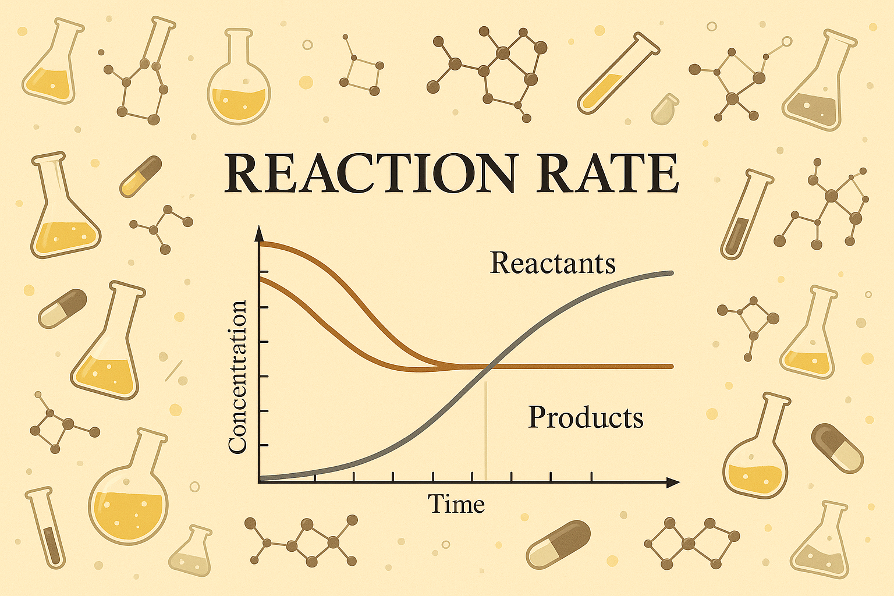

<h1 align="center">
rxnrate2: Modeling Chemical Reaction Kinetics with Python
</h1>

<br>

## Simulating Reaction Dynamics with Linear and Nonlinear Systems  
### Collaborator: Mio Kobayashi, Ambrine Maud Labout, Elodie-Angélique Lendi, Clarice Jasmine Mihalache 
#### Practical Programming in Chemistry @ EPFL

## Table of Contents
- :pen:[Introduction](#pen-introduction)
- :paintbrush:[Features](#paintbrush-features)
- :fire:[Usage](#fire-usage)
- :computer:[Installation](#computer-installation)
- :hammer:[Development Installation](#hammer-development-installation)
- :scroll:[License](#scroll-license)

## :pen: Introduction

This package was developed as part of the *Practical Programming in Chemistry* course at EPFL (Spring 2025).  
**rxnrate2** simulates the time evolution of chemical species in reaction networks, both linear (first-order) and nonlinear (mass-action), using Python-based numerical solvers. Additionnaly, the molecules involved in the reactions are also shown.

It is designed to support:
- graphical exploration of reaction kinetics,
- numerical investigations of concentrations over time,
- and visualizations via an optional Streamlit app (for the molecular reaction and the kinetics over time).

## :paintbrush: Features


**rxnrate2** provides a flexible and intuitive framework for simulating chemical reaction dynamics.

### 🔹 First-Order Linear Reactions
- Supports arbitrary reaction networks with one reagent and one product.
- Define reaction systems where the rate of change of each species is a linear combination of others.
- Uses matrix exponentials or `solve_ivp` with a coefficient matrix for efficient time evolution.
- Suitable for systems like radioactive decay chains, unimolecular reactions, and sequential steps.

### 🔹 Nonlinear Mass-Action Kinetics
- Supports arbitrary reaction networks with any number of species and reactions.
- Handles reversible and irreversible reactions.
- Rates computed via mass-action laws: forward and backward rates depend on instantaneous concentrations.
- Suitable for many types of systems which include multiple reagents and products.

### 📉 Concentration Profile Plotting built-in
- Built-in matplotlib-based visualization of species concentrations over time.
- Supports both linear and nonlinear simulations.
- Automatically assigns colors and handles legends for clarity.

### 🧪 Streamlit GUI for Interactive Exploration
- Launch an intuitive web app to:
  - Define reactions with species and rate constants.
  - Set initial concentrations and time span.
  - Visualize concentration dynamics instantly.
  - Visualize the reaction with the help of diagramms showing the molecules.
- Ideal for demos, teaching, or quick testing of reaction models without coding.


### Example Reaction Types Supported

- `A → B → C` (linear chain)
- `A + B ⇌ C` (nonlinear reversible)

## :fire: Usage

The rxnrate2 package lets you simulate chemical reaction networks using concise and readable Python code. You can model both linear (first-order) and nonlinear (mass-action) systems — and even visualize them interactively.

### Linear Example: A → B → C

```python
from rxnrate2.linear import build_M_matrix, solve_reaction, plot_solution

M = build_M_matrix([
    ("A", "B", 1.0),
    ("B", "C", 0.5),
])

y0 = [1.0, 0.0, 0.0]
t_span = (0, 10)

sol = solve_reaction(M, y0, t_span)
plot_solution(sol, ["A", "B", "C"])
```

➡️ This example shows a simple unidirectional chain reaction using a linear rate matrix and saves the plot if just the functions are used.

### Nonlinear Example: A + B ⇌ C

```python
from rxnrate2.nonlinear import ReactionSystem

rxn = ReactionSystem([
    ("A + B", "C", 1.0),
    ("C", "A + B", 0.3),
])

y0 = {"A": 1.0, "B": 1.0, "C": 0.0}
t_span = (0, 10)

sol = rxn.solve(y0, t_span)
rxn.plot_solution(sol)
```
➡️ This demonstrates how to set up nonlinear reversible reactions using symbolic reaction strings and automatic ODE generation if just the functions are used.

### Streamlit Interface
To explore the interactive interface, you can launch the **Streamlit GUI** in the following way:

From VS Code or Terminal:
Navigate to the root of your project (where the `src/` folder lives) and run:

```bash
streamlit run src/rxnrate2/Interface_rxnrate/Home.py
```

## :hammer: Installation

Create and activate a new environment:

```bash
conda env create -f environment.yml
conda activate rxnrate2
```

Install the package:

```bash
(rxnrate2) pip install -e .
```

To use the Streamlit GUI, ensure you have Streamlit installed (already included in the `environment.yml`, but in case you need to reinstall):

```bash
(rxnrate2) pip install streamlit
```

## :hammer: Development Installation

Set up the repo locally:

```bash
git clone https://github.com/clarice-m04/rxnrate2.git
cd rxnrate2
(rxnrate2) pip install -e ".[test,doc]"
```

To initialize git and push (only if starting from scratch):

```bash
git init
git add .
git commit -m "Initial commit"
git branch -M main
git remote add origin git@github.com:clarice-m04/rxnrate2.git
git push -u origin main
```

### Run tests and coverage

```bash
pip install tox
tox
```

## :scroll: License

This project is licensed under the MIT License. You are free to use, modify, and distribute this software under the terms described in the [LICENSE](LICENSE) file.

For the full legal text, see the [LICENSE](LICENSE) file in this repository.
