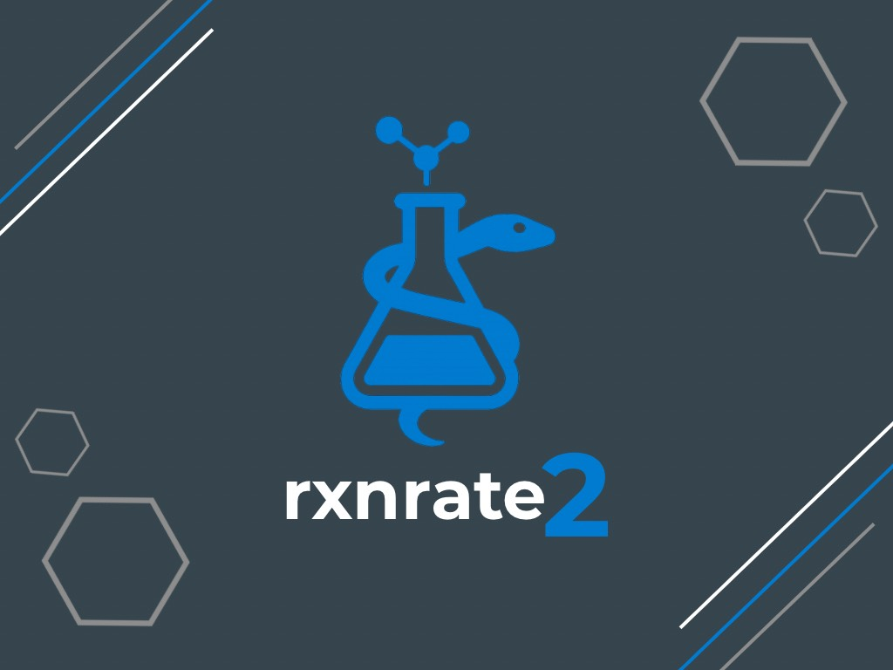

<h1 align="center">
rxnrate2: Modeling Chemical Reaction Kinetics with Python
</h1>

<br>

## Simulating Reaction Dynamics with Linear and Nonlinear Systems  
### Collaborator: Mio Kobayashi, Ambrine Maud Labout, Elodie-Angélique Lendi, Clarice Jasmine Mihalache 
#### Practical Programming in Chemistry @ EPFL

## Table of Contents
- :pen:[Introduction](#pen-introduction)
- :paintbrush:[Features](#paintbrush-features)
- :fire:[Usage](#fire-usage)
- :computer:[Installation](#computer-installation)
- :hammer:[Development Installation](#hammer-development-installation)
- :scroll:[License](#scroll-license)

## :pen: Introduction

This package was developed as part of the *Practical Programming in Chemistry* course at EPFL (Spring 2025).  
**rxnrate2** simulates the time evolution of chemical species in reaction networks — both linear (first-order) and nonlinear (mass-action) — using Python-based numerical solvers.

It is designed to support:
- educational exploration of reaction kinetics,
- numerical investigations of concentrations over time,
- and visualizations via an optional Streamlit app.

## :paintbrush: Features

**rxnrate2** enables you to:

- 📈 Model **first-order linear reactions** using matrix-based ODEs.
- 🔁 Simulate **nonlinear mass-action systems** with reversible reactions.
- 📊 Visualize concentration profiles over time with graphs.
- 💡 Interact with reactions using a built-in **Streamlit GUI**.

### Example Reaction Types Supported

- `A → B → C` (linear chain)
- `A + B ⇌ C` (nonlinear reversible)

## :fire: Usage

### Linear Example: A → B → C

```python
from rxnrate2.linear import build_M_matrix, solve_reaction, plot_solution

M = build_M_matrix([
    ("A", "B", 1.0),
    ("B", "C", 0.5),
])

y0 = [1.0, 0.0, 0.0]
t_span = (0, 10)

sol = solve_reaction(M, y0, t_span)
plot_solution(sol, ["A", "B", "C"])
```

### Nonlinear Example: A + B ⇌ C

```python
from rxnrate2.nonlinear import ReactionSystem

rxn = ReactionSystem([
    ("A + B", "C", 1.0),
    ("C", "A + B", 0.3),
])

y0 = {"A": 1.0, "B": 1.0, "C": 0.0}
t_span = (0, 10)

sol = rxn.solve(y0, t_span)
rxn.plot_solution(sol)
```

## :hammer: Installation

Create and activate a new environment:

```bash
conda create -n rxnrate2 python=3.10
conda activate rxnrate2
```

Install the package:

```bash
pip install .
```

To use the Streamlit GUI, also install:

```bash
pip install streamlit
```

## :hammer: Development Installation

Set up the repo locally:

```bash
git clone https://github.com/clarice-m04/rxnrate2.git
cd rxnrate2
pip install -e ".[test,doc]"
```

To initialize git and push (only if starting from scratch):

```bash
git init
git add .
git commit -m "Initial commit"
git branch -M main
git remote add origin git@github.com:clarice-m04/rxnrate2.git
git push -u origin main
```

### Run tests and coverage

```bash
pip install tox
tox
```

## :scroll: License

This project is licensed under the MIT License. You are free to use, modify, and distribute this software under the terms described in the [LICENSE](LICENSE) file.

For the full legal text, see the [LICENSE](LICENSE) file in this repository.
